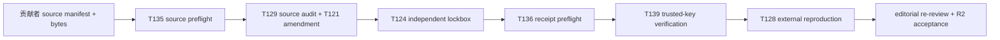

# R2 外部证据实施路径

本文件是贡献者、独立 evaluator、外部 reproduction team 和编辑复审者的
**操作顺序**。它不是结果报告，也不授权任何一方把预检通过写成科学结论。

## 顺序与产物

1. 贡献者在仓库外提供 source manifest 和资产目录；运行
   `python -m biointerfaceos data preflight-external-source-intake --manifest <manifest> --assets-root <assets> --strict`。
   该命令只检查结构、字节哈希和声明字段，不承认许可真实性或科学映射。
2. 研究团队依据第一方文件审计实验室、单位、材料/尺寸协变量、共享终点和
   preprocessing；只有跨实验室目标通过 T129 后才能形成 T121 amendment。
3. 冻结 estimand、study-held-out split、模型配置、阈值、代码和环境后，
   独立 evaluator 在受保护观测上运行 T124。作者不得访问保护值或调参。
4. evaluator、外部 reproduction team 和 editor 分别提供三份文件；运行
   `python -m biointerfaceos data preflight-external-verification --bundle <bundle> --documents-root <documents> --strict`。
5. 对预检后的三份文件运行 T139 detached-signature 校验。签名校验仍不等于
   现实身份认证，身份、范围和利益冲突必须由 scope owner 审计。
6. 非作者 reproduction team 在独立 checkout/environment 中重新获取或 attests
   source data，提交 commands、deviation ledger 和 aggregate-only result。
   编辑复审必须逐项覆盖 R2-01 至 R2-09；未解决 Critical finding 只能保持
   `IN_PROGRESS` 或降级稿件定位。

## 当前状态

T143 只证明上述路径在代码、协议、模板和当前收据之间没有漂移。当前没有
external source、protected observation、真实 evaluator 身份、外部 reproduction
报告或 editorial acceptance；`scientific_submission_ready` 必须保持 `false`。
